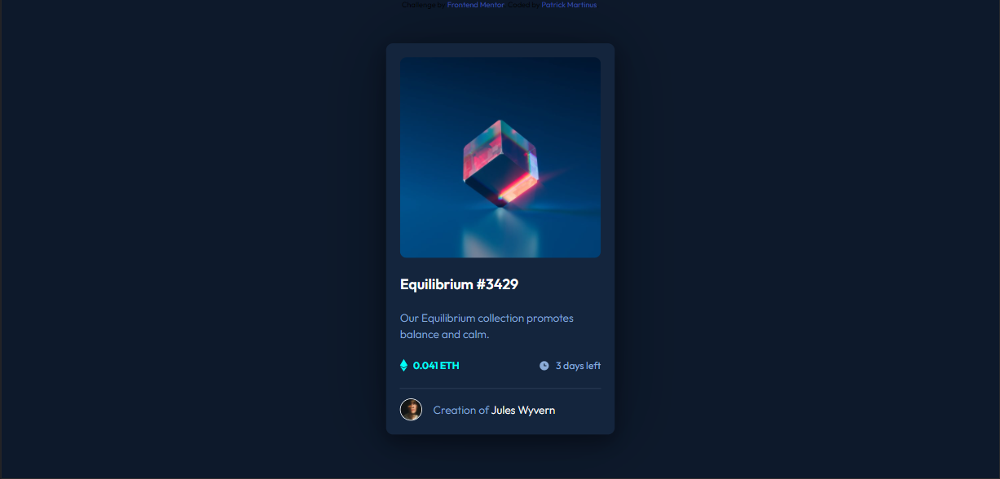

# Frontend Mentor - NFT preview card component solution

This is a solution to the [NFT preview card component challenge on Frontend Mentor](https://www.frontendmentor.io/challenges/nft-preview-card-component-SbdUL_w0U). Frontend Mentor challenges help you improve your coding skills by building realistic projects.

## Table of contents

- [Overview](#overview)
  - [The challenge](#the-challenge)
  - [Screenshot](#screenshot)
  - [Links](#links)
- [My process](#my-process)
  - [Built with](#built-with)
  - [What I learned](#what-i-learned)
  - [Continued development](#continued-development)
  - [Useful resources](#useful-resources)
- [Author](#author)

**Note: Delete this note and update the table of contents based on what sections you keep.**

## Overview

### The challenge

Users should be able to:

- View the optimal layout depending on their device's screen size
- See hover states for interactive elements

### Screenshot



### Links

- Solution URL: [nft-preview-card-component](https://github.com/TrickPatMK/nft-preview-card-component)
- Live Site URL: [Add live site URL here](https://trickpatmk.github.io/nft-preview-card-component/)

## My process

I enjoyed my time working on it. There were some obstacles while I was working on it, like in the active state part, but I was able to overcome them

### Built with

- Semantic HTML5 markup
- CSS custom properties
- Flexbox
- Mobile-first workflow

### What I learned

for active state, i give background-color to the figure instead of the overlay.

```css
figure {
  background-color: #00fff7;
}
figure img {
  opacity: 1;
}
```

and when hovered

```css
.card-image:hover figure img {
  opacity: 0.5;
}
```

### Continued development

further i'm going to use grid instead of flexbox

### Useful resources

- [Example resource 1](https://codepen.io/nxworld/pen/ZYNOBZ) - This helped me for the active state

## Author

- Frontend Mentor - [@TrickPatMK](https://www.frontendmentor.io/profile/TrickPatMK)
- Twitter - [@TrickPatMK](https://www.twitter.com/PatrickMartK)
